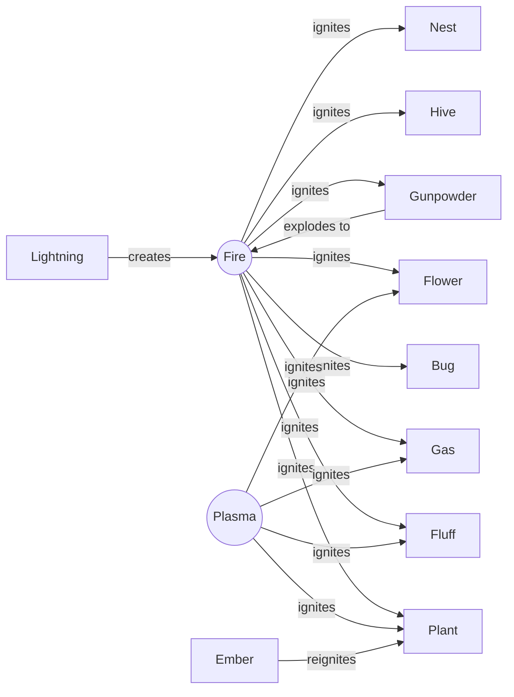
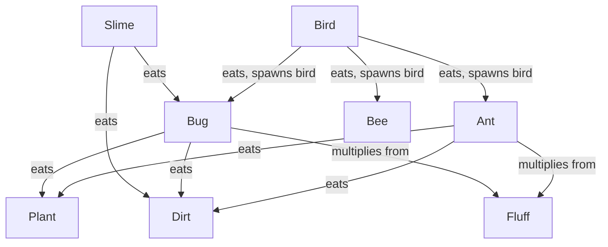
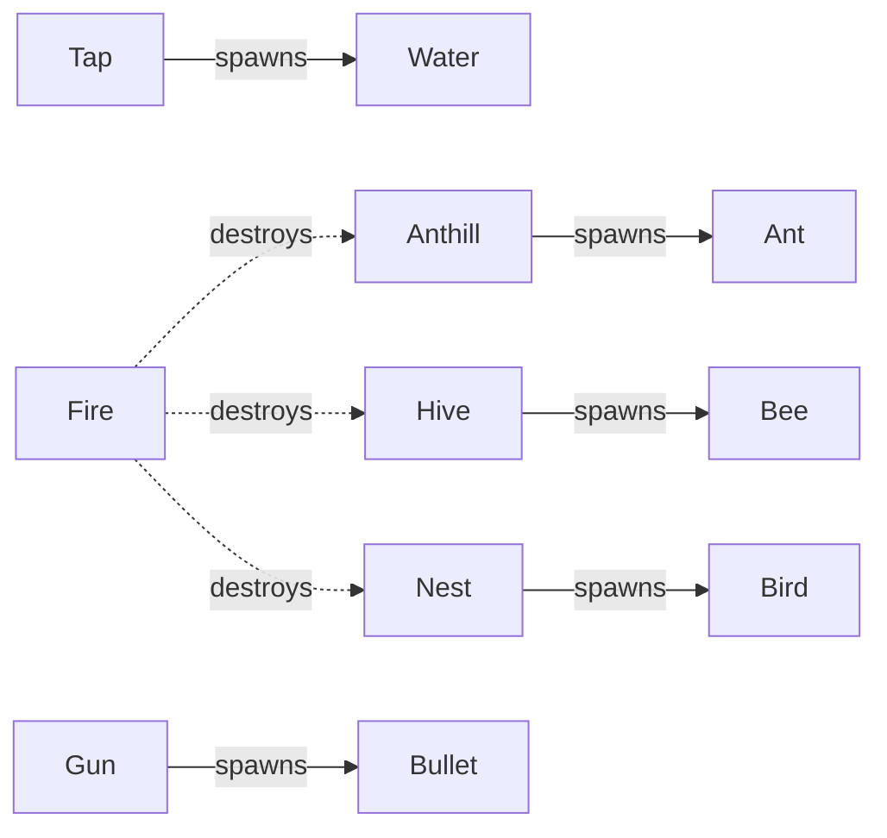
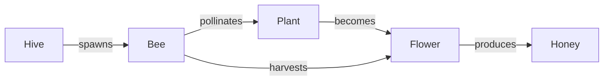
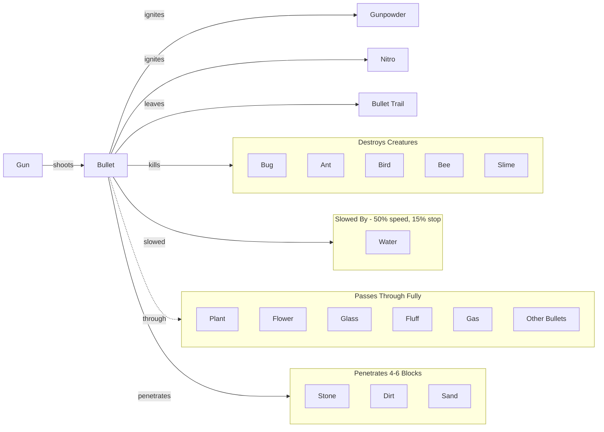

# Wheats.app - Falling Sand Game

A falling sand physics simulation game built with React + TypeScript + Vite.

**Play at:** [wheats.app](https://wheats.app)

## Development Workflow

**Important: Always build and push after making changes!**

```bash
bun run build && git add -A && git commit -m "Your message" && git push -u origin <branch-name>
```

The game builds to `/docs` folder for GitHub Pages deployment.

---

## Particle Types

### Basic Elements
| Particle | Color | Behavior |
|----------|-------|----------|
| **Sand** | Tan | Falls, piles up, sinks through water |
| **Water** | Blue | Flows, spreads sideways, enables plant growth |
| **Dirt** | Brown | Falls slowly, can sprout plants when touching them |
| **Stone** | Grey | Static, destroyed by gunpowder explosions and bullets |
| **Glass** | Light blue | Static, created when lightning strikes sand, can crystallize |

### Organic Elements
| Particle | Color | Behavior |
|----------|-------|----------|
| **Plant** | Green | Static, grows when water + dirt nearby, flammable |
| **Flower** | Purple | Static, created by bees from plants, spreads slowly to plants |
| **Fluff** | Off-white | Floats down slowly, flammable, food for ants/bugs |
| **Honey** | Orange-gold | Very slow flowing liquid, sinks in water, turns to ember on fire |

### Creatures
| Particle | Color | Behavior |
|----------|-------|----------|
| **Bug** | Pink | Crawls around, eats dirt/plant/honey/fluff, swims, multiplies from fluff |
| **Ant** | Brown-red | Tunnels through most materials, floats on water, climbs plants, multiplies from fluff |
| **Bird** | Light grey | Flies around, eats ants/bugs/bees (spawns more birds), turns to fluff when hungry |
| **Bee** | Yellow | Buzzes around, creates flowers from plants, makes honey from flowers |
| **Slime** | Yellow-green | Eats dirt/sand/bugs, floats up through water |

### Energy Elements
| Particle | Color | Behavior |
|----------|-------|----------|
| **Fire** | Orange/red | Rises, spreads to flammables, decays to gas/ember/nothing |
| **Plasma** | Purple | Rises, spreads to sand, ignites flammables, decays quickly |
| **Lightning** | Yellow | Strikes downward, turns sand→glass, ignites flammables, spreads through water |
| **Ember** | Orange-red | Glowing coal, falls slowly, can reignite nearby flammables |
| **Static** | Cyan | Electrical residue, jitters around, can spark into lightning |

### Explosives
| Particle | Color | Behavior |
|----------|-------|----------|
| **Nitro** | Bright green | Falls, explodes on contact with solids, creates stone from water |
| **Gunpowder** | Dark grey | Falls like sand, massive explosion on fire (radius 12, destroys stone) |

### Special Elements
| Particle | Color | Behavior |
|----------|-------|----------|
| **Gas** | Grey | Rises, dissipates slowly, flammable |
| **Crystal** | Bright cyan | Static, grows from glass, slowly decays to sand |
| **Alien** | Lime green | Terraformer - transforms materials into organic matter, duplicates |
| **Quark** | Magenta | Chaotic terraformer - teleports, shoots lightning/static, creates inorganic matter |

### Spawners
| Particle | Color | Behavior |
|----------|-------|----------|
| **Tap** | Silver | Static, spawns water below continuously |
| **Anthill** | Yellow-brown | Static, spawns ants, burns on fire |
| **Hive** | Amber | Static, spawns bees, burns on fire |
| **Nest** | Brown-grey | Static, spawns birds, burns on fire |
| **Gun** | Dark grey | Static, shoots bullets in random directions (single pixel placement) |

### Projectiles (Internal - not paintable)
| Particle | Color | Behavior |
|----------|-------|----------|
| **Bullet** | Bright yellow | Moves in straight line, passes through soft materials, penetrates solids (4-6 blocks), ignites explosives |
| **Bullet Trail** | Yellow (dimmer) | Fades quickly (~0.1 sec), marks bullet path |

---

## Particle Interactions

### Fire Interactions
- **Ignites:** Plant, Fluff, Bug, Gas, Gunpowder, Flower, Hive, Nest
- **Created by:** Lightning striking flammables, Ember reigniting, Gunpowder explosion

### Creature Food Chain
```
Bird eats → Ant, Bug, Bee (spawns new bird 60%, leaves plant 40%)
Ant eats → Sand, Dirt, Plant, Fluff*, Bug, Nitro, Slime, Honey
Bug eats → Dirt, Plant, Honey, Fluff*
Slime eats → Dirt, Sand, Bug
* Eating Fluff causes multiplication
```

### Terraformer Transformations

**Alien (organic focus):**
- Sand → Glass/Plant/Alien
- Dirt → Plant/Water/Alien
- Water → Slime/Plant/Water/Alien
- Plant → Bug/Plant/Alien
- Glass → Fluff/Alien
- Stone (rare) → Glass/Dirt

**Quark (inorganic focus):**
- Plant/Dirt → Sand/Stone/Ember
- Water → Static/Lightning/Sand
- Glass → Crystal/Sand
- Sand → Stone/Lightning
- Slime → Ember/Plasma/Sand
- Bug/Fluff → Ember/Fire

### Explosion Effects

**Gunpowder (radius 12):**
- Destroys: Stone, Glass, all organic matter
- Creates: Fire, Glass (from sand), Gas (from water)
- Chain reaction with other gunpowder

**Nitro (radius 8):**
- Destroys: Most materials
- Creates: Fire, Stone (from water)

### Bullet Behavior
- **Ignites:** Gunpowder, Nitro (then stops)
- **Destroys:** Bug, Ant, Bird, Bee, Slime (continues through)
- **Slowed by:** Water (50% speed, 15% chance to stop per block)
- **Passes through fully:** Plant, Flower, Glass, Fluff, Gas, other bullets
- **Penetrates with limit (~4-6 blocks):** Stone, Dirt, Sand
- **Stops at:** Guns, spawners
- **Leaves:** Yellow bullet trail that fades quickly

---

## Interaction Diagrams

### Fire Spread Network


### Creature Food Chain


### Spawner Relationships


### Bee Ecosystem


### Bullet Interactions


---

## Technical Notes

### Internal Particles
Some particles are internal and not directly paintable:
- **Bullets (8 directions):** BULLET_N, BULLET_NE, BULLET_E, BULLET_SE, BULLET_S, BULLET_SW, BULLET_W, BULLET_NW
- **Bullet Trail:** Yellow fading trail left behind by bullets

These are spawned by the Gun particle and track their own direction.

### Particle Processing Order
1. **Rising elements** (top to bottom): Fire, Gas, Plasma, Lightning, Bullets, Bird, Bee
2. **Falling elements** (bottom to top): Sand, Water, Dirt, Fluff, Bug, Nitro, Slime, Ant, Alien, Quark, Crystal, Ember, Static, Glass, Gunpowder, Tap, Anthill, Flower, Hive, Honey, Nest, Gun

### Special Spawn Rules
- **Gun:** Always spawns as single 4px block (1 particle)
- **Bird/Bee:** Spawn at 20% rate (sparse)
- **Ant:** Spawn at 40% rate
- **Alien/Quark:** Spawn at 8% rate (very sparse)

---

## Controls
- **Click/drag:** Paint selected particle
- **Scroll wheel:** Adjust brush size (1-15)
- **Material buttons:** Select particle type
- **Play/Pause:** Control simulation
- **Reset:** Clear canvas
- **Erase:** Remove particles

---

## Testing

Playwright is set up for automated testing. Requires Node.js >= 18.19 and bun.

### Quick Start

```bash
make setup            # Install deps + Playwright Chromium
make test             # Run all tests
```

### All Commands

```bash
make test             # Run all tests headless
make test-headed      # Run with visible browser
make test-ui          # Interactive Playwright UI mode
make report           # Open HTML test report
make clean            # Remove test artifacts
```

Or use the shell script directly:

```bash
./run-tests.sh                # Run all tests (handles nvm/node setup)
./run-tests.sh --headed       # With visible browser
./run-tests.sh --grep "canvas" # Run specific tests
```

Or via bun:

```bash
bun run test          # Run all tests
bun run test:headed   # Run with visible browser
bun run test:ui       # Interactive UI mode
```

Tests cover control buttons, particle selection, and canvas interactions.

---

## React + TypeScript + Vite

This template provides a minimal setup to get React working in Vite with HMR and some ESLint rules.

- [@vitejs/plugin-react](https://github.com/vitejs/vite-plugin-react/blob/main/packages/plugin-react) uses [Babel](https://babeljs.io/) for Fast Refresh
- [@vitejs/plugin-react-swc](https://github.com/vitejs/vite-plugin-react/blob/main/packages/plugin-react-swc) uses [SWC](https://swc.rs/) for Fast Refresh
