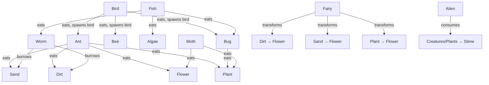
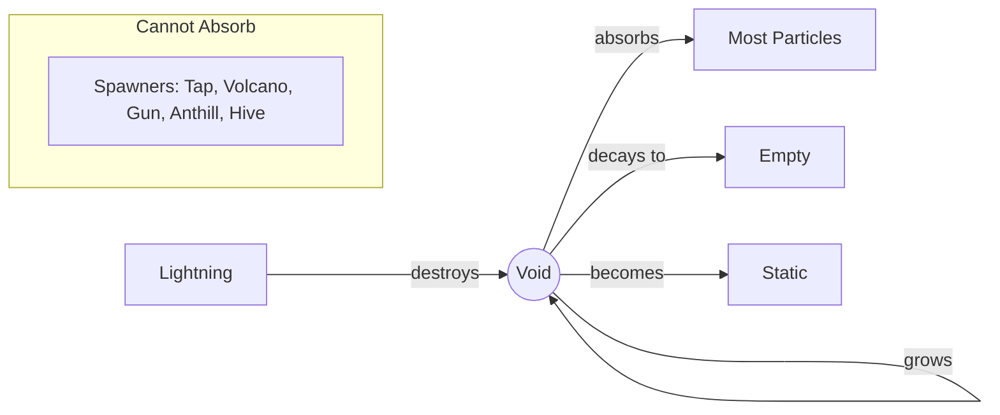

# Wheats.app - Falling Sand Game

A falling sand physics simulation game built with React + TypeScript + Vite.

**Play at:** [wheats.app](https://wheats.app)

## Deployment

The site is automatically built and deployed to GitHub Pages via GitHub Actions whenever
changes are pushed to `main`. The workflow runs `npm run build` and deploys the `dist`
output using `actions/deploy-pages@v4`.

No manual build or publish step is needed — just merge to `main` and the CI handles the rest.

---

## Particle Types

### Basic Elements
| Particle | Color | Behavior |
|----------|-------|----------|
| **Sand** | Tan | Falls, piles up, sinks through water |
| **Water** | Blue | Flows, spreads sideways, enables plant growth |
| **Dirt** | Brown | Falls slowly, can sprout plants when touching them |
| **Stone** | Grey | Static, survives explosions, can be penetrated by bullets (4-6 blocks), absorbed by black holes |
| **Glass** | Light blue | Static, created when lightning strikes sand, can crystallize |

### Organic Elements
| Particle | Color | Behavior |
|----------|-------|----------|
| **Plant** | Green | Static, grows when water + dirt nearby, flammable |
| **Flower** | Purple | Static, created by bees from plants, spreads slowly to plants |
| **Fluff** | Off-white | Floats down slowly, flammable, food for ants/bugs |
| **Honey** | Orange-gold | Very slow flowing liquid, sinks in water, turns to ember on fire |

### Creatures
| Particle | Color | Behavior |
|----------|-------|----------|
| **Bug** | Pink | Crawls around, eats plants, swims through water |
| **Ant** | Brown-red | Tunnels through dirt/sand/plant/flower, floats on water, eats upward toward food |
| **Bird** | Light grey | Flies around, eats ants/bugs/bees (spawns more birds), turns to fluff when starving |
| **Bee** | Yellow | Buzzes around, pollinates plants into flowers, harvests flowers for honey |
| **Firefly** | Bright chartreuse | Glowing creature, emits glitter/static trails, attracted to flowers, breeds near flowers, killed by water/acid/birds |
| **Worm** | Dusty rose | Burrows through dirt and sand, swims through water, eaten by birds, killed by fire/lava/acid |
| **Fairy** | Pink-magenta | Floats upward, transforms dirt/sand into flowers, turns plants into flowers, leaves glitter trails, dies to fire/lava/plasma (becomes glitter) |
| **Fish** | Orange | Aquatic creature, must stay adjacent to water or dies, eats bugs/algae/worms |
| **Moth** | Tan | Attracted to light sources (fire/ember/firefly/lightning), eats plants/flowers, dies in fire/lava/plasma |
| **Alien** | Lime green | Consumes creatures and organic matter, leaves slime trails, dies to fire/plasma/lightning (becomes slime) |

### Energy Elements
| Particle | Color | Behavior |
|----------|-------|----------|
| **Fire** | Orange/red | Rises, spreads to flammables, decays to gas/ember/nothing |
| **Plasma** | Purple | Rises, spreads to sand, ignites flammables, decays quickly |
| **Lightning** | Yellow | Strikes downward, turns sand→glass, ignites flammables, spreads through water |
| **Ember** | Orange-red | Glowing coal, falls slowly, can reignite nearby flammables |
| **Static** | Cyan | Electrical residue, jitters around, can spark into lightning |

### Explosives
| Particle | Color | Behavior |
|----------|-------|----------|
| **Nitro** | Bright green | Falls, explodes on contact with solids (radius 12), creates stone from water |
| **Gunpowder** | Dark grey | Falls like sand, explodes on fire (radius 6), does not destroy stone/glass |

### Hazardous Elements
| Particle | Color | Behavior |
|----------|-------|----------|
| **Acid** | Toxic yellow-green | Corrosive liquid, dissolves organics (dirt, sand, plants, creatures), neutralized by water into gas |
| **Lava** | Deep crimson | Molten rock, flows slowly, ignites flammables, melts sand→glass, cools to stone with water/snow |
| **Snow** | Icy light blue | Falls slowly like fluff, piles up, freezes water→ice, melts near fire/lava/plasma/ember |
| **Mercury** | Silver metallic | Liquid metal, very dense (sinks through most materials), toxic to creatures, reflects bullets! |
| **Slime** | Yellow-green | Slow viscous liquid, falls and spreads slowly, melts into gas near heat sources |
| **Void** | Deep purple | Dark matter, absorbs nearby particles (not stone/glass/crystal), can grow when eating, slowly decays, destroyed by lightning |

### Growth Elements
| Particle | Color | Behavior |
|----------|-------|----------|
| **Seed** | Tan/wheat | Falls like sand, grows 20-30 pixel tall plant stems with branching near top, grows through dirt/water, massive growth near sun |
| **Algae** | Blue-green | Aquatic plant, lives in water, spreads to nearby water, grows faster near sun, converted by poison |
| **Spore** | Dark purple | Floats up slowly, spreads mold on contact with organics, dies in fire/acid |

### Decay Elements
| Particle | Color | Behavior |
|----------|-------|----------|
| **Rust** | Orange-brown | Spreads slowly to nearby sand/dirt, weakens materials, created when water touches certain metals |
| **Poison** | Sickly purple | Toxic substance, spreads slowly to organic matter (plant, algae, dirt), kills creatures on contact |
| **Mold** | Medium purple | Organic terraformer - spreads across organics (plant, flower, dirt, honey), releases gas, dies in fire/acid |
| **Dust** | Tan/beige | Very light, floats down slowly like fluff, highly flammable, disperses in wind |

### Bright/Effect Particles
| Particle | Color | Behavior |
|----------|-------|----------|
| **Firework** | Multicolor | Single pixels that shoot straight up, then explode into colorful sparks |
| **Bubble** | Light cyan | Rises through liquids, turns to gas when reaching air |
| **Glitter** | Silver | Sparkly silver particles that fade (fast at first, then slowly when clustered) |
| **Star** | Bright yellow | Sun - grows plants/algae/flowers in large radius (18px), boosts seed growth massively, melts snow, evaporates water, constantly emits glitter and static |
| **Comet** | Cyan/white | Fast-moving streak, leaves blue fire trail behind |
| **Blue Fire** | Blue | Blue flame effect, left as trail by comets, rises and fades like regular fire |

### Cosmic Elements
| Particle | Color | Behavior |
|----------|-------|----------|
| **Black Hole** | Deep black/purple | Gravitational singularity - pulls in and destroys ALL nearby particles including stone, glass, and crystal; only spawners (tap, volcano, gun, anthill, hive) are immune |

### Special Elements
| Particle | Color | Behavior |
|----------|-------|----------|
| **Gas** | Grey | Rises, dissipates slowly, flammable |
| **Crystal** | Bright cyan | Static, grows from glass, slowly decays to sand |
| **Alien** | Lime green | Predator - consumes creatures and organics, leaves slime trails |
| **Quark** | Magenta | Chaotic terraformer - random walk, transforms materials into inorganic matter |

### Spawners
| Particle | Color | Behavior |
|----------|-------|----------|
| **Tap** | Silver | Static, spawns water below continuously |
| **Cloud** | Light grey | Floats around, drops water slowly (slower than tap) |
| **Volcano** | Dark maroon | Erupts lava upward, emits embers, cooled by water (rarely turns to stone) |
| **Anthill** | Yellow-brown | Static, spawns ants, burns on fire |
| **Hive** | Amber | Static, spawns bees, burns on fire |
| **Nest** | Brown-grey | Static, spawns birds, burns on fire |
| **Gun** | Dark grey | Static, shoots bullets in random directions (single pixel placement) |
| **Star** | Bright yellow | Sun emitter - continuously spawns glitter and static particles nearby |

### Projectiles (Internal - not paintable)
| Particle | Color | Behavior |
|----------|-------|----------|
| **Bullet** | Bright yellow | Moves in straight line, passes through soft materials, penetrates solids (4-6 blocks), ignites explosives |
| **Bullet Trail** | Yellow (dimmer) | Fades quickly (~0.1 sec), marks bullet path |

---

## Particle Interactions

### Fire Interactions
- **Ignites:** Plant, Fluff, Bug, Gas, Gunpowder, Flower, Hive, Nest, Dust, Spore
- **Created by:** Lightning striking flammables, Ember reigniting, Gunpowder explosion, Comet trails (blue fire)
- **Blue Fire:** Special variant left by comets, same behavior as regular fire but blue colored

### Creature Food Chain
```
Bird eats → Ant, Bug, Bee (spawns new bird 60%, leaves plant 40%)
Ant eats → Dirt, Sand, Plant, Flower (tunnels through and removes)
Bug eats → Plant (leaves dirt)
Fish eats → Bug, Algae, Worm (in water)
Worm eats → Dirt, Sand (burrows through)
Moth eats → Plant, Flower
Fairy transforms → Dirt/Sand→Flower, Plant→Flower, Water→Glitter
Alien eats → Creatures, Plants, Flowers (leaves slime)
```

### Alien Behavior

The Alien is a predator/consumer that moves with an upward bias:
- Empty space → moves, occasionally leaves slime trail (10%)
- Creatures (Bug, Ant, Bird, Bee, Slime) + Plants/Flowers → consumed, replaced with slime
- Fire/Plasma/Lightning → alien dies, becomes slime

**Quark (inorganic focus):**
- Plant/Dirt → Sand/Stone/Ember
- Water → Static/Lightning/Sand
- Glass → Crystal/Sand
- Sand → Stone/Lightning
- Slime → Ember/Plasma/Sand
- Bug/Fluff → Ember/Fire

### Explosion Effects

**Gunpowder (radius 6, heat-triggered):**
- Preserves: Stone, Glass, Water
- Turns everything else to Fire
- Chain reaction with other gunpowder

**Nitro (radius 12, contact-triggered):**
- Preserves: Stone, Glass
- Turns water → Stone (70%) or Empty (30%)
- Turns everything else to Fire

### Bullet Behavior
- **Ignites:** Gunpowder, Nitro (then stops)
- **Destroys:** Bug, Ant, Bird, Bee, Slime (continues through)
- **Slowed by:** Water (50% speed, 15% chance to stop per block)
- **Passes through fully:** Plant, Flower, Glass, Fluff, Gas, Guns, other bullets
- **Penetrates with limit (~4-6 blocks):** Stone, Dirt, Sand
- **Stops at:** Spawners (Tap, Anthill, Hive, Nest)
- **Leaves:** Yellow bullet trail that fades quickly

---

## Interaction Diagrams

### Fire Spread Network


### Creature Food Chain


### Spawner Relationships


### Bee Ecosystem


### Bullet Interactions


### Acid Corrosion


### Temperature Interactions


### Mold Decomposition


### Mercury Properties


### Void Absorption


### Seed Growth Cycle


### Sun (Star) Effects


### Black Hole Gravity


### Poison & Algae Interactions


### Bright Particle Effects


---

## Technical Notes

### Internal Particles
Some particles are internal and not directly paintable:
- **Bullets (8 directions):** BULLET_N, BULLET_NE, BULLET_E, BULLET_SE, BULLET_S, BULLET_SW, BULLET_W, BULLET_NW
- **Bullet Trail:** Yellow fading trail left behind by bullets
- **Blue Fire:** Blue flame particles left as trail by comets

These are spawned by other particles (Gun spawns bullets, Comet spawns blue fire).

### Particle Processing Order
1. **Rising elements** (top to bottom): Fire, Blue Fire, Gas, Plasma, Lightning, Bullets, Bird, Bee, Firefly, Bubble, Spore, Firework, Cloud, Comet
2. **Falling/Static elements** (bottom to top): Sand, Water, Dirt, Fluff, Bug, Nitro, Slime, Ant, Alien, Worm, Fairy, Fish, Moth, Quark, Crystal, Ember, Static, Dust, Glitter, Glass, Gunpowder, Snow, Tap, Anthill, Flower, Hive, Honey, Nest, Gun, Seed, Mold, Rust, Algae, Poison, Volcano, Star, Black Hole

### Special Spawn Rules
- **Gun:** Single pixel only (ignores brush size)
- **Bird/Bee/Firefly:** 15% spawn rate (sparse)
- **Ant/Bug/Slime:** 25% spawn rate
- **Alien/Quark:** 8% spawn rate (very sparse)
- **Mold/Spore:** 35% spawn rate
- **All other particles:** 45% spawn rate
- **Black Hole:** Single pixel, high impact - use sparingly
- **Star (Sun):** Static, affects large area (radius 18), emits static and glitter particles
- **Firework:** Single pixels that launch upward before exploding
- **Comet:** Fast-moving, leaves blue fire trail

---

## Controls
- **Click/drag:** Paint selected particle
- **Scroll wheel:** Zoom in/out (anchored on cursor)
- **Right-click drag:** Pan the viewport
- **Right-click + scroll:** Adjust brush size (1-30)
- **Pinch-to-zoom:** On touch devices (two-finger gesture)
- **Keyboard `[` / `-`:** Decrease brush size
- **Keyboard `]` / `=`:** Increase brush size
- **Brush indicator:** Drag left/right to adjust brush size
- **Material dropdown:** Select particle type (6 categories: basic, fluid, energy, nature, spawner, critter)
- **Play/Pause:** Control simulation
- **Reset:** Clear canvas (requires two clicks to confirm)
- **Save:** Export grid as `.sand` file
- **Load:** Import a previously saved `.sand` file
- **Erase:** Remove particles (found in the basic material category)

---

## Testing

Playwright is set up for automated testing. Requires Node.js >= 18.19.

### Quick Start

```bash
make setup            # Install deps + Playwright Chromium
make test             # Run all tests
```

### All Commands

```bash
make test             # Run all tests headless
make test-headed      # Run with visible browser
make test-ui          # Interactive Playwright UI mode
make report           # Open HTML test report
make clean            # Remove test artifacts
```

Or use the shell script directly:

```bash
./run-tests.sh                # Run all tests (handles nvm/node setup)
./run-tests.sh --headed       # With visible browser
./run-tests.sh --grep "canvas" # Run specific tests
```

Or via npm:

```bash
npm run test          # Run all tests
npm run test:headed   # Run with visible browser
npm run test:ui       # Interactive UI mode
```

Tests cover control buttons, particle selection, and canvas interactions.
