# Particle Interaction Diagrams

## Particle Categories

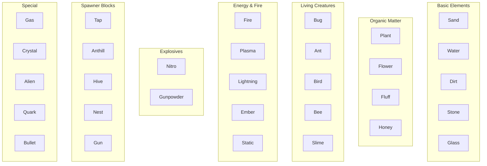

## Fire Spread Network

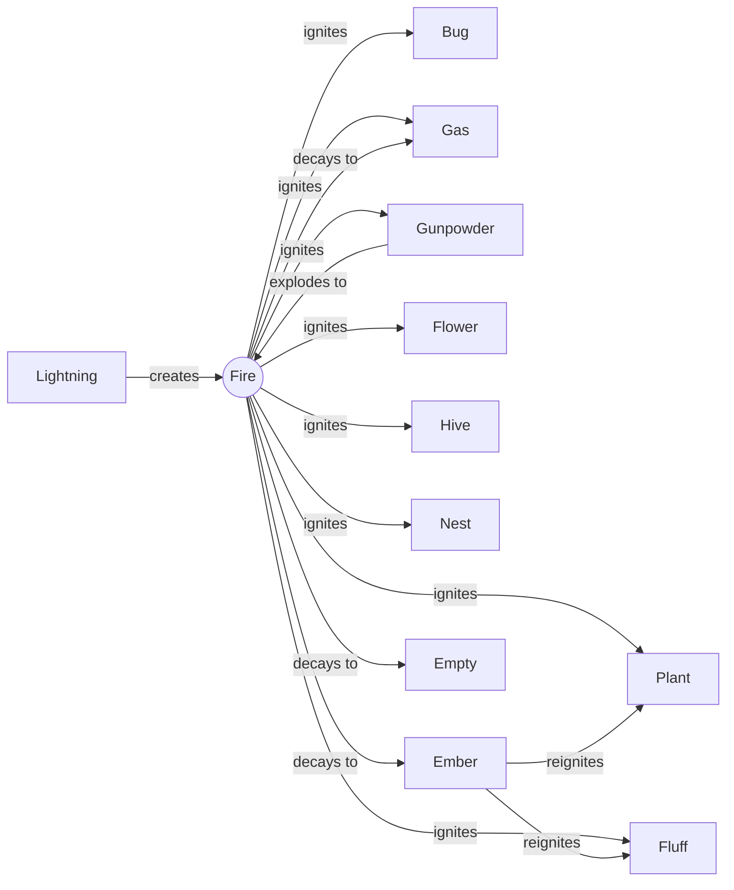

## Creature Food Chain

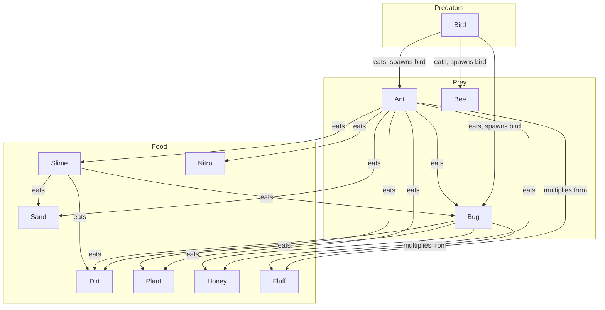

## Spawner Relationships

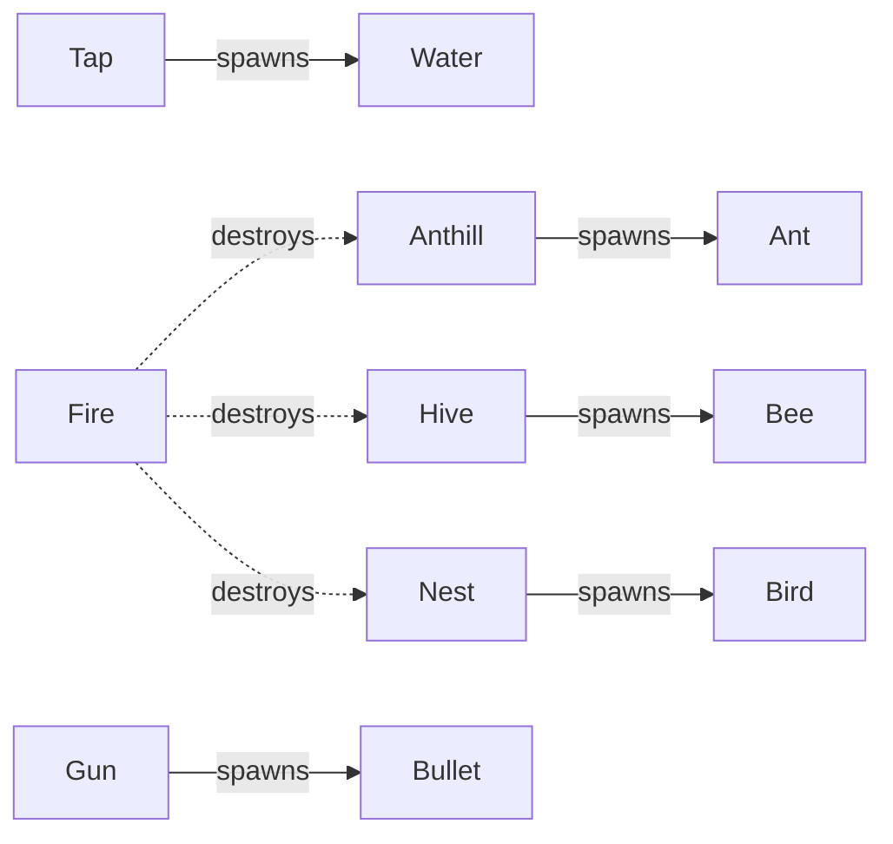

## Bee Ecosystem

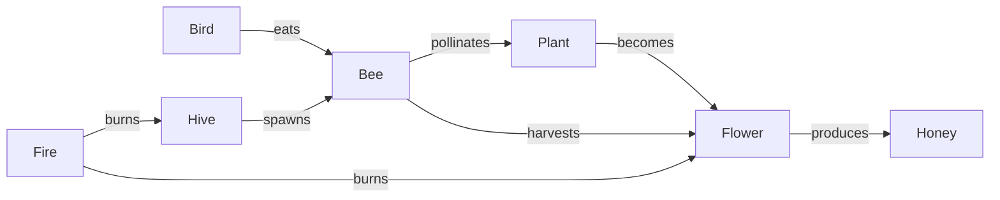

## Alien Terraforming

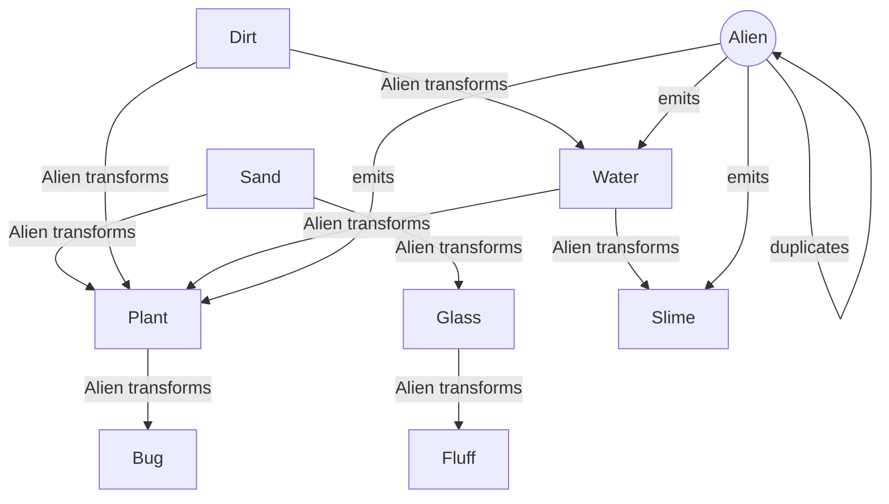

## Quark Chaos

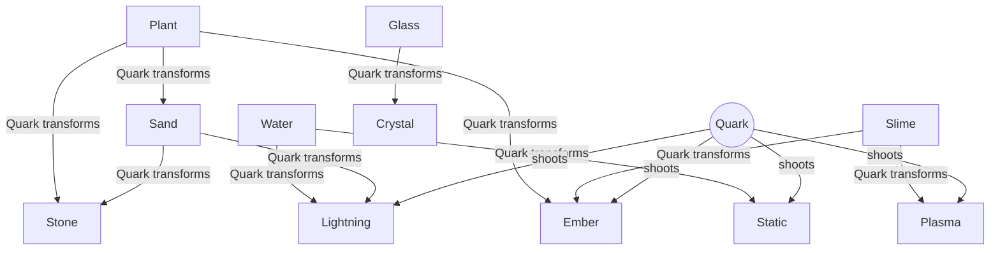

## Explosion Chains

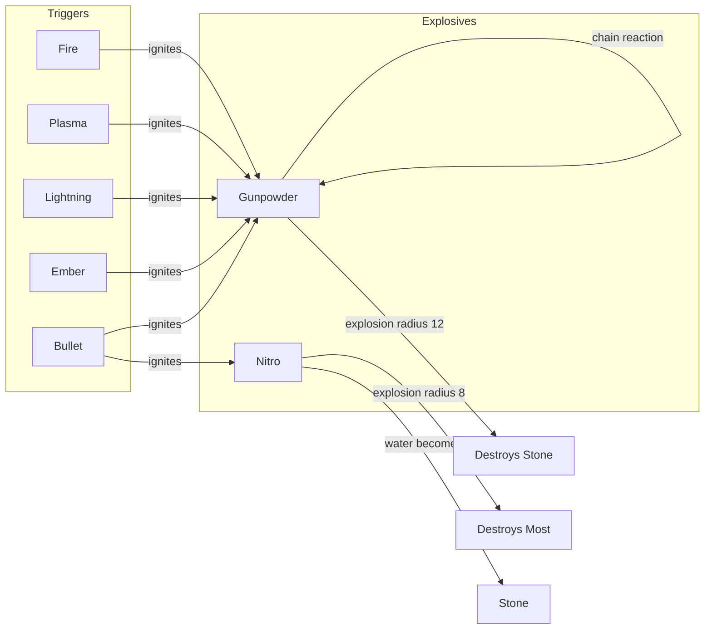

## Bullet Interactions

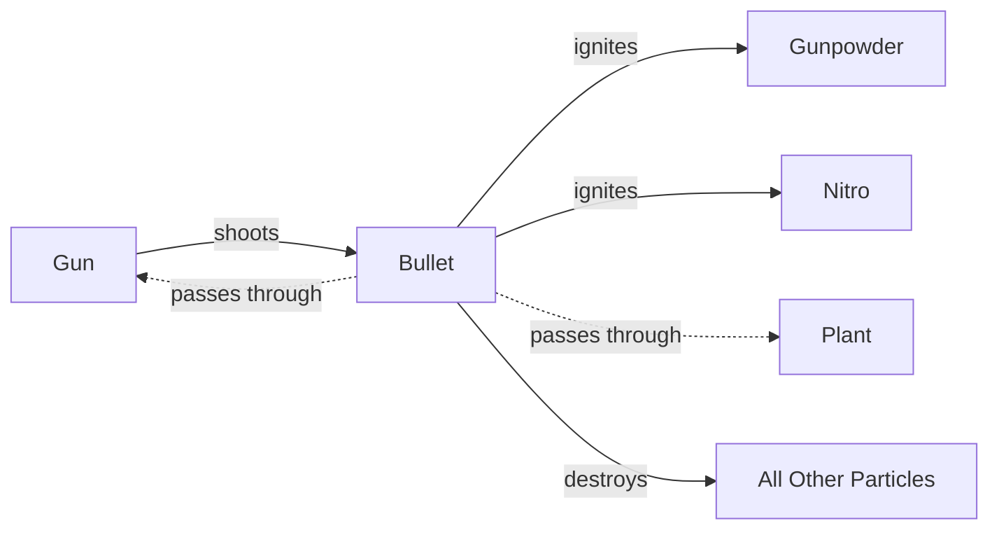

## Lightning Effects

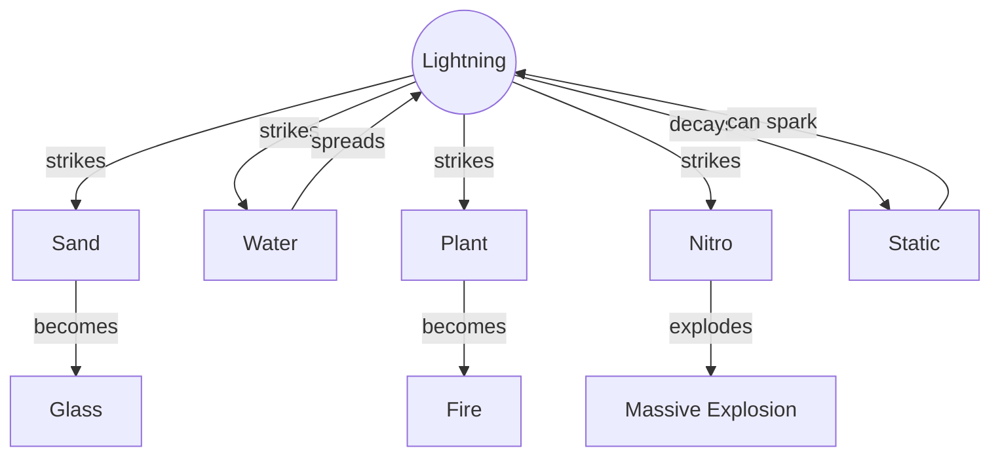

## Material Density (Sinking Behavior)

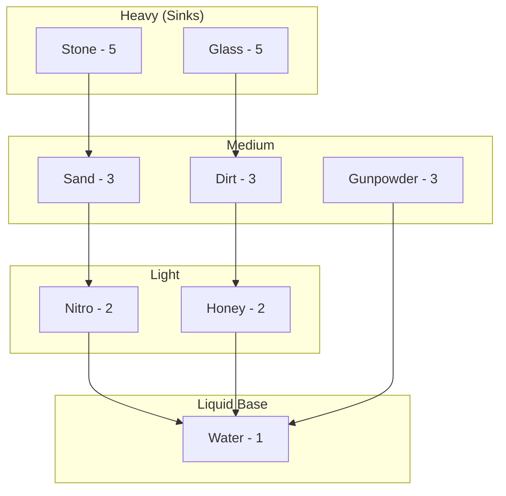

## Complete Interaction Matrix

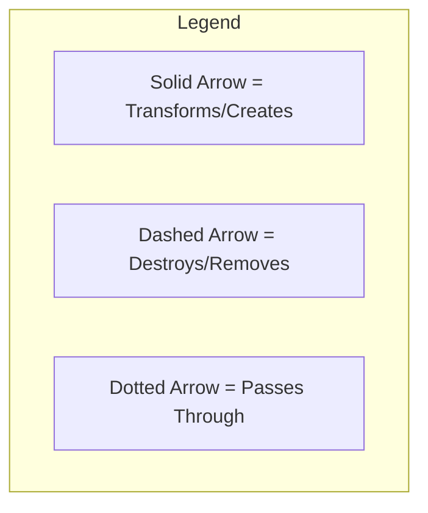

### Key Interactions Summary:
- **Fire spreads to:** Plant, Fluff, Bug, Gas, Gunpowder, Flower, Hive, Nest
- **Lightning transforms:** Sand→Glass, ignites flammables, spreads in water
- **Alien creates:** Plant, Bug, Slime, Fluff, Water (organic focus)
- **Quark creates:** Stone, Glass, Crystal, Lightning, Static, Ember (inorganic focus)
- **Bullets:** Destroy most things, ignite explosives, pass through plants
- **Creatures eat:** Various materials, multiply from Fluff
